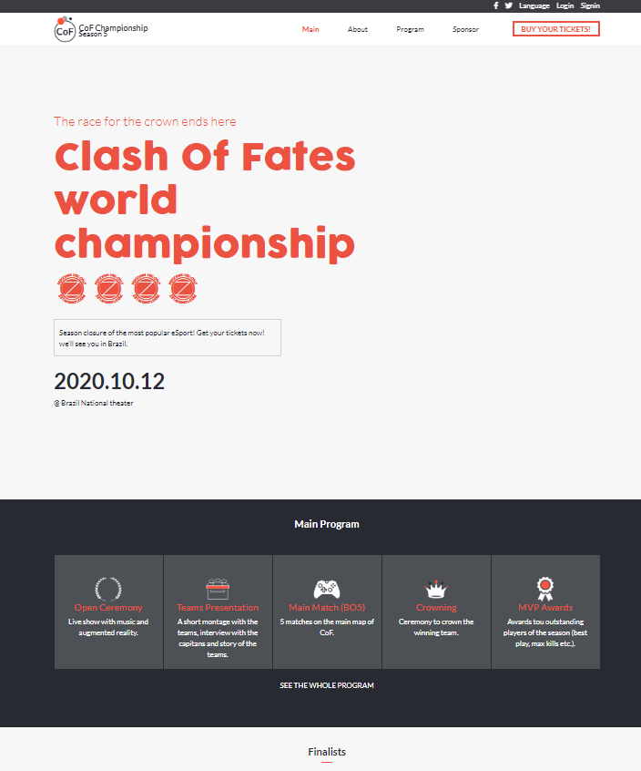

# Capstone Event Page

> This is a project of Microverse about imitate a Cindy Shin's Global Summit page.

## Built With

- HTML
- CSS
- Boothstrap

## Live Demo

[Watch the project on you browser!](https://dazzling-hugle-b56b13.netlify.com/)

## Requirements

- Use semantic HTML tags.
- Use semantic HTML tags.
- Use HTML elements box model (margin, padding, width, height).
- Use industry-standard tools (flexbox) to place elements in the page.
- Ability to create UIs adaptable to different screen sizes using mediaqueries.
- Apply front-end best practices.
- Ability to create UIs adjusted to given designs.
- Strong English written and verbal communication.
- Ability to communicate information effectively to technical and non-technical people.
- Ability to translate business requirements into software solutions.
- Ability to work well in a fast-paced environment under deadlines.
- Ability to perform tasks and complete projects with minimal supervision.

## Authors

👤 **Johann Alonso Rodríguez Vázquez**

- Github: [@JohannRodriguez](https://github.com/JohannRodriguez)
- Twitter: [@BSapce](https://https://twitter.com/BSapce)
- Linkedin: [Johann Rodríguez](https://www.linkedin.com/in/johann-alonso-rodr%C3%ADguez-v%C3%A1zquez-25b07719a/)

## 🤝 Contributing

Contributions, issues and feature requests are welcome!

Feel free to check the [issues page](https://github.com/JohannRodriguez/Capstone-project-conference-page/issues).

## Show your support

Give a ⭐️ if you like this project!

## Acknowledgments

- To Cindy Shin and her project CC Global Summit 2015, in which I based to make this project, yo can check the original material here: [Cindy Shin CC Global Summit 2015](https://www.behance.net/gallery/29845175/CC-Global-Summit-2015)

## 📝 License

This project is [MIT](lic.url) licensed.
